<h1>Project Name</h1>

This project demonstrates how to set up a CI pipeline using GitHub Actions with Slack notifications and GitHub Pages for reporting.

The main focus in this project on CI pipeline, tests and scripts was autogenerated by the playwright. Steps of implementation on your project written at Getting Started section.

<h2>Key Concepts and Structure</h2>

- `name`: This specifies the name of the workflow or steps. In this case, it's "CI Pipeline."
- `on`: This defines the events that trigger the workflow. The pipeline is triggered by:
    - `workflow_dispatch`: Manual trigger.
    - `push`: Automatically triggered when changes are pushed to the main branch.
    - `schedule`: Automatically triggered at 03:00 from Monday through Friday using a cron schedule.
- `jobs`: This section defines the jobs that will run as part of the workflow. Each job can have multiple steps.
- `installRunAndDeploy`: This is the name of the job. It includes all the steps necessary to install dependencies, run tests, and deploy the results.
- `runs-on`: Specifies the type of virtual machine to run the job on. Here, it uses ubuntu-latest.

More about github pipeline syntax read here: https://docs.github.com/en/actions/writing-workflows/workflow-syntax-for-github-actions

<h2> Speciality of GitHub Actions YAML Format </h2>

- Modularity: The YAML format allows for modular and reusable workflows. Each job and step can be independently defined and reused across different workflows.
- Event-driven: Workflows are triggered by specific events, such as pushes, pull requests, or scheduled times, making them highly flexible and responsive to changes.
- Environment Variables: The use of environment variables (${{ }} syntax) allows for dynamic values to be used within the workflow, such as secrets and outputs from previous steps.
- Actions: GitHub Actions provides a marketplace of pre-built actions that can be easily integrated into workflows, reducing the need for custom scripts.
- Parallel Execution: Jobs can be run in parallel, optimizing the use of resources and reducing the time taken for the entire workflow to complete.


<h2>Getting Started</h2>

1. Create a Repository

Begin by creating a new repository on GitHub.

2. Configure Workflow Permissions

To allow the CI pipeline to deploy to GitHub Pages, you need to set the workflow permissions to "Read and write permissions."

Navigate to Settings -> Actions -> General.

Under Workflow permissions, select Read and write permissions.

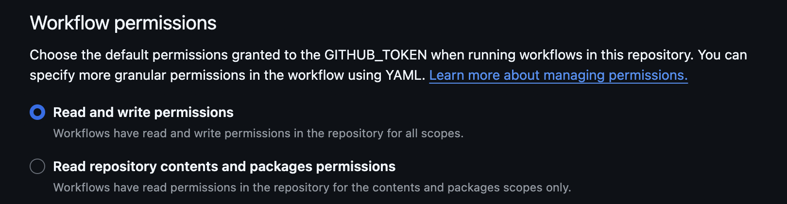


3. Create a gh-pages Branch

Create a new branch named gh-pages. This branch will be used to host the GitHub Pages site.

You can create the branch via the GitHub UI or using the command line:
```
git checkout -b gh-pages
```
The contents of this branch do not matter initially.

4. Set Up Slack

Create a Slack account or log in to an existing one. Then, create a new channel where you want to receive notifications.

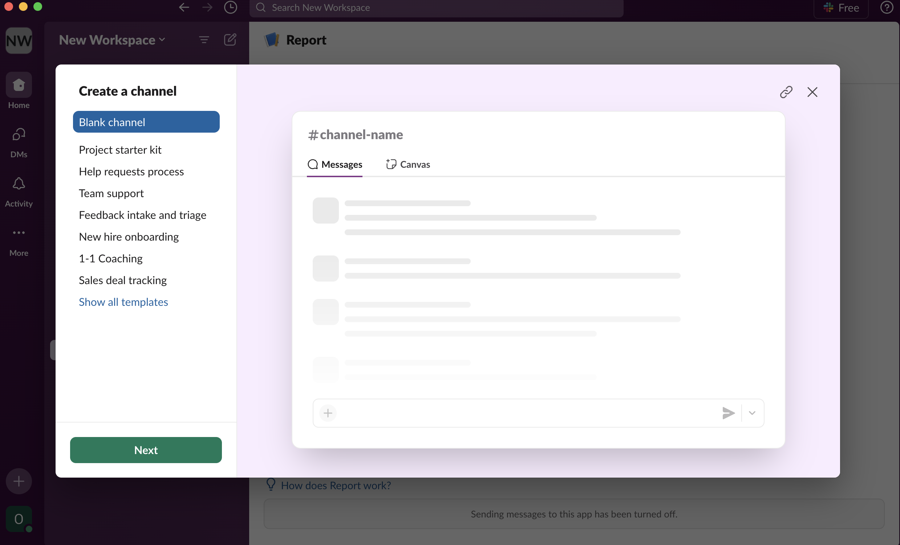
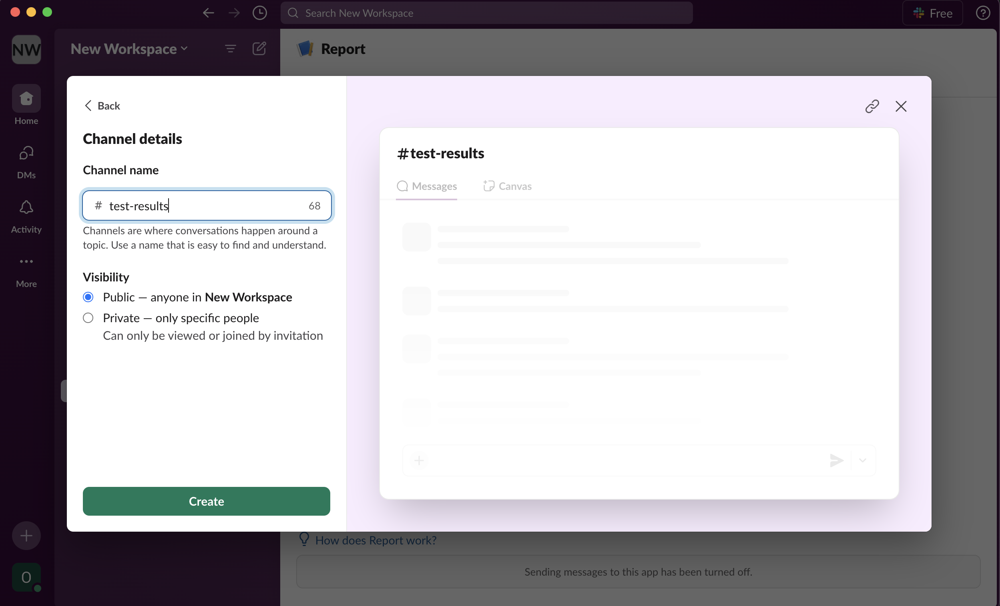

5. Create a Slack App

Go to Slack API Apps (https://api.slack.com/apps/) and create a new app from scratch.

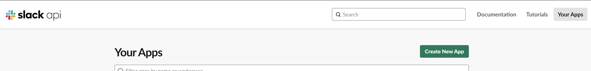
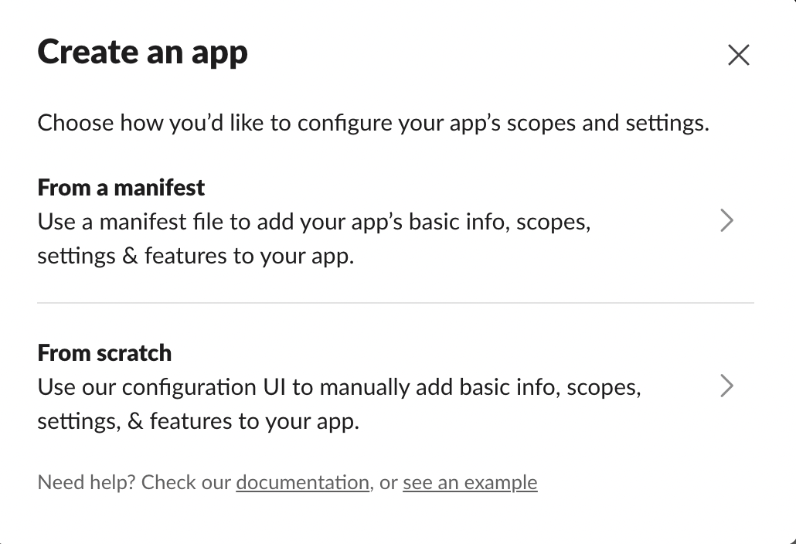

Provide a name for your app and select the workspace you want to use.

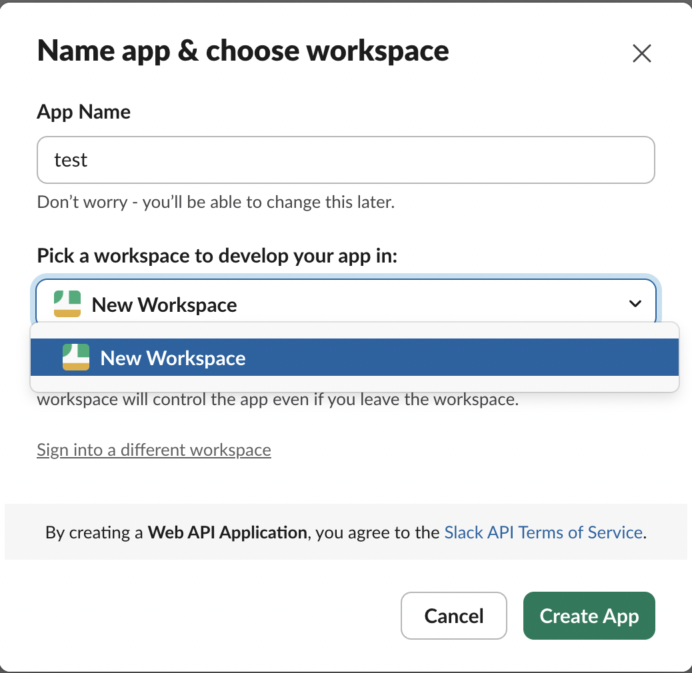

Navigate to the "Incoming Webhooks" section in the created app and activate incoming webhooks.

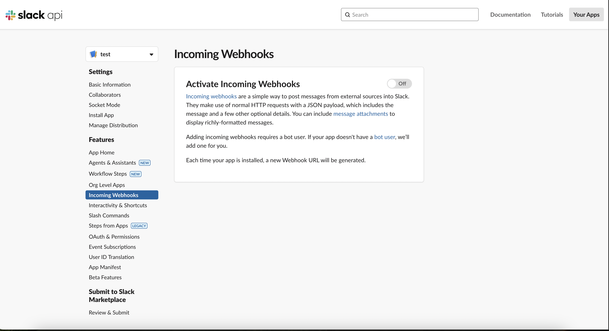

Enable the webhook feature: Enable Webhooks.

Add a new webhook to your workspace and choose the channel created in step 4.

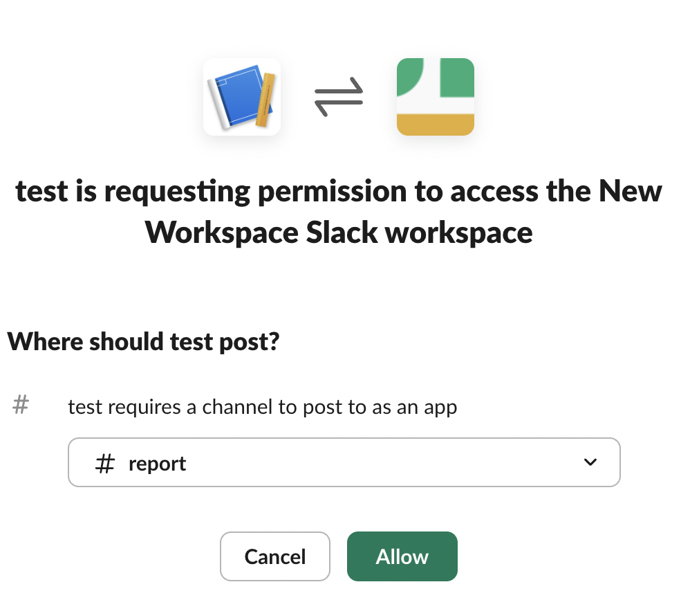

Copy the webhook URL.

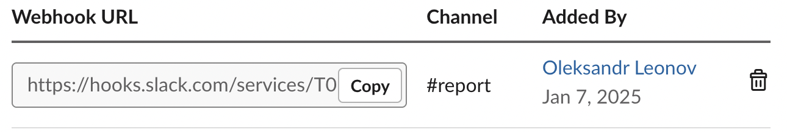


6. Add Secret to GitHub Repository

Add the Slack webhook URL as a secret in your GitHub repository:

Navigate to Settings -> Secrets and variables -> Actions -> Repository secrets.

Create a new repository secret named `SLACK_WEBHOOK_URL` and paste the URL from step 5.

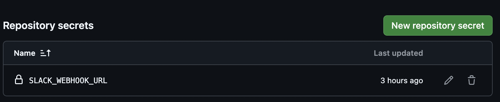

7. Finaly create `.yml` file inside `.github/workflows` folder and add content from the example.

<h2>CI Pipeline Overview</h2>

The CI pipeline is configured to run on every push to the main branch. It performs the following steps:

1. Checkout Code: Uses the `actions/checkout@v4` action to clone the repository.

2. Install Dependencies: Runs `npm install` to install project dependencies.

3. Install Playwright Browsers: Installs the necessary browsers for Playwright testing using `npx playwright install`.

4. Notify Slack - Before Tests: Sends a notification to Slack indicating that the tests are starting.

5. Run Playwright Tests: Executes the Playwright tests. The `continue-on-error: true` option allows the workflow to proceed even if tests fail.

6. Upload Test Results: Uses `actions/upload-artifact@v4` to upload the test results as an artifact.

7. Copy Test Results to Public Directory: Copies the test results to a public directory for deployment.

8. Parse XML Test Results: Extracts test results from the XML report using shell commands and sets them as environment variables.

9. Deploy to GitHub Pages: Uses `peaceiris/actions-gh-pages@v3` to deploy the contents of the public directory to the `gh-pages` branch.

10. Notify Slack - After Tests: Sends a notification to Slack with the test results and a link to the GitHub Pages report.

Example of slack notification:

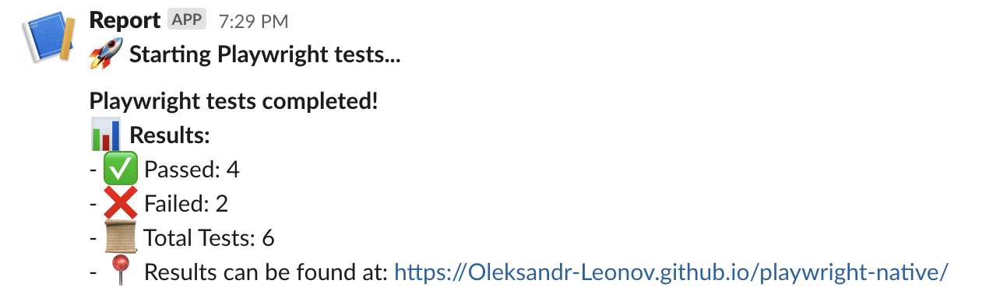

<h2>Pros and Cons of GitHub Pages Reporting</h2>

Pros:
- Fast and efficient.
- No additional resources required.
- Compatible with most popular static HTML reporters.

Cons:
- Only one gh page is available for 1 repo.
- No run history (can be added for reporters like Allure, but limited to the last 10 runs).
- Access issues: GitHub Pages works best with public repositories (private pages are available only with paid subscriptions).